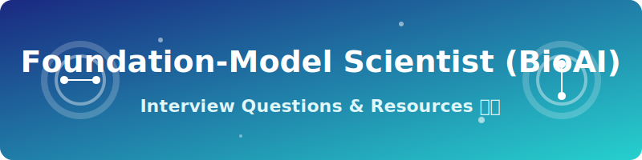

# Foundation-Model Scientist (BioAI) Interview Questions 🧬🔬

<p align="center">
  <a href="https://github.com/ishandutta2007/Awesome-Awesome-Awesome"></a><a href="https://discord.gg/jc4xtF58Ve"></a>
  <a href="https://github.com/ishandutta2007/Awesome-Foundation-Model-Scientist-BioAI-Interview-Questions/issues"></a>
  <a href="https://github.com/ishandutta2007/Awesome-Foundation-Model-Scientist-BioAI-Interview-Questions/pulls"></a>
  <a href="https://github.com/ishandutta2007/Awesome-Foundation-Model-Scientist-BioAI-Interview-Questions/blob/main/LICENSE"></a>
</p>

<p align="center">
  
</p>

*The ultimate SEO-optimized guide and repository for Foundation Model Scientist, BioAI, and Machine Learning in Biology interview preparation. Master your BioAI interviews with our comprehensive Q&A collection!*

A curated, community-driven collection of interview questions (with model answers, frameworks, and explanations) for **Foundation Model Scientist / Research Scientist roles building large-scale AI models for biology** — protein language models, genomic sequence models, single-cell foundation models, and multimodal bio-AI systems.

This is not a list of trivia. Every question includes:
- 🎯 **Why interviewers ask it**
- 💡 **A model answer or framework**
- 🔍 **Follow-up questions** interviewers commonly use to probe deeper

> 🌱 This is v1. Contributions, corrections, and new questions are very welcome — see [CONTRIBUTING.md](CONTRIBUTING.md).

> ⚠️ **Note on scope:** This role is research-scientist-flavored — it assumes strong general deep learning/ML research fundamentals (transformers, self-supervised learning, scaling laws) already exist and focuses on **what's specific to applying and adapting these methods to biological sequence, structure, and expression data**. This is one of the fastest-moving subfields in ML — treat any specific model, benchmark, or architecture claim in this repo as a snapshot in time and verify against current literature before an interview. For adjacent, complementary content, see companion repos on **Computational Biologist**, **Genomics Data Scientist**, **AI Drug Discovery Scientist**, and **ML Engineer (Biotech)** roles.

---

## 📚 Table of Contents

| # | Category | What it covers |
|---|----------|-----------------|
| 1 | [Foundation Model Fundamentals for Biology](questions/01-foundation-model-fundamentals-for-biology.md) | What makes a model a "foundation model," self-supervision, transfer learning in bio |
| 2 | [Architectures & Tokenization for Biological Data](questions/02-architectures-and-tokenization.md) | Transformers for sequences, protein/genomic LMs, tokenization strategies |
| 3 | [Pretraining Objectives & Self-Supervised Learning](questions/03-pretraining-objectives-and-self-supervised-learning.md) | Masked modeling, contrastive learning, scaling laws for bio data |
| 4 | [Evaluation & Benchmarking](questions/04-evaluation-and-benchmarking.md) | Downstream task evaluation, probing, embedding quality, generalization |
| 5 | [Multimodal & Cross-Domain Integration](questions/05-multimodal-and-cross-domain-integration.md) | Sequence-structure-function models, single-cell foundation models |
| 6 | [Scaling, Compute & Data Curation](questions/06-scaling-compute-and-data-curation.md) | Distributed pretraining, data curation/deduplication at scale, scaling laws in practice |
| 7 | [Research Rigor & Responsible Publication](questions/07-research-rigor-and-responsible-publication.md) | Reproducibility, benchmark gaming, dual-use, model release decisions |
| 8 | [Behavioral & Case Studies](questions/08-behavioral-and-case-studies.md) | Research direction decisions, collaboration between ML researchers and biologists |

Also see: [resources.md](resources.md) for external reading, key papers, and communities.

---

## 🧭 How to Use This Repo

- 🚀 **Coming from a general ML/deep learning research background moving into BioAI?** Prioritize sections 1, 2, and 5 first — you'll need to build fluency in what's actually different about biological sequence/structure data compared to text or images.
- 🧬 **Coming from a computational biology/bioinformatics background moving into foundation model research?** Prioritize sections 3, 4, and 6 — the goal is building rigor in self-supervised learning theory, scaling behavior, and modern evaluation methodology.
- 🧪 **Interviewing at a company/lab building protein language models specifically?** Focus heavily on sections 2 and 4.
- 🔬 **Interviewing at a company/lab building single-cell or multi-omics foundation models?** Focus heavily on section 5.
- 📖 **Interviewing at an organization with a strong publication/open-research culture?** Expect more emphasis on section 7.
- 💼 **Interviewing at an applied/product-focused BioAI team?** Expect more emphasis on section 4 and section 8 — practical evaluation and cross-functional collaboration matter more than novel architecture research in these settings.

Each question is tagged with a rough difficulty and role-level indicator:
- 🟢 New-grad/PhD-entry · 🟡 Mid-level Research Scientist · 🔴 Senior/Staff Research Scientist

---

## 🗂 Repo Structure

```
foundation-model-scientist-bioai-interview-questions/
├── README.md                                              ← you are here
├── CONTRIBUTING.md
├── LICENSE
├── resources.md
└── questions/
    ├── 01-foundation-model-fundamentals-for-biology.md
    ├── 02-architectures-and-tokenization.md
    ├── 03-pretraining-objectives-and-self-supervised-learning.md
    ├── 04-evaluation-and-benchmarking.md
    ├── 05-multimodal-and-cross-domain-integration.md
    ├── 06-scaling-compute-and-data-curation.md
    ├── 07-research-rigor-and-responsible-publication.md
    └── 08-behavioral-and-case-studies.md
```

## 🤝 Contributing

PRs are the whole point of this repo. If you were asked a question in a real interview that isn't here, add it! See [CONTRIBUTING.md](CONTRIBUTING.md) for format guidelines.

## 📄 License

Content is available under [MIT License](LICENSE) — use it freely for your own prep, mock interviews, or hiring loops.

## ⭐ Support

If this helped you land an offer, consider starring the repo and adding the question that stumped you — it might help the next person.
